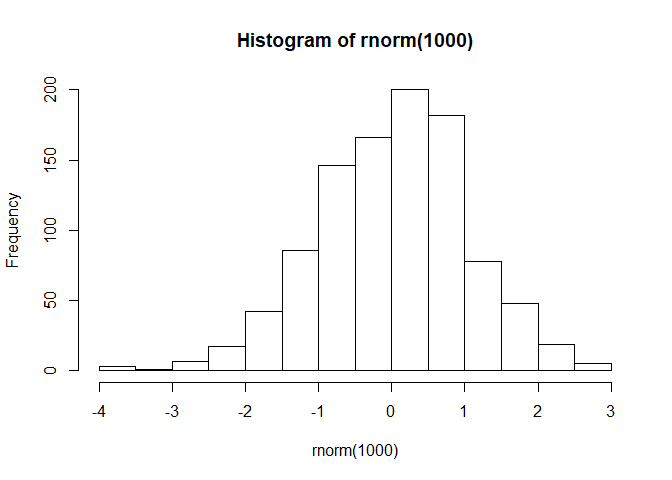

HIMB Summer Course
================

Tim's notebook
==============

Some things to remember:
------------------------

``` r
# some syntax to remember

# <> this is for putting in an email, e.g., <http.msi.org>

# $$ this is for putting equations, e.g., $$ y = mx + b $$

# ![] this is for putting photos, but you need to place the photo first on the directory, e.g., ![]HIMBProg/image.jpg
```

``` r
hist(rnorm(1000))
```



``` r
# if {r, echo=F} removes the line in the command
```
